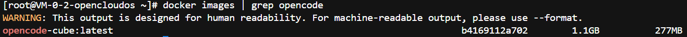
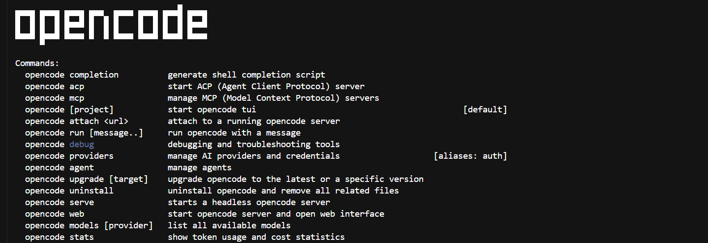

# OpenCode Agent 集成指南

[English](../../../guide/integrations/opencode.md)

在 CubeSandbox MicroVM 内运行 [OpenCode](https://www.npmjs.com/package/@earendil-works/pi-coding-agent)
（面向终端的 AI 编码 Agent）。本文覆盖镜像构建、密钥注入、出网管控，以及基于快照的会话持久化，配套的可运行示例位于
[`examples/opencode-integration`](https://github.com/TencentCloud/CubeSandbox/tree/master/examples/opencode-integration)。

## 集成对象与版本

| 组件 | 版本 |
|---|---|
| OpenCode CLI | 最新 release（可通过 --build-arg OPENCODE_VERSION=x.y.z 固定 |
| Node.js | 24（通过 NodeSource 安装） |
| CubeSandbox 基础镜像 | `ghcr.io/tencentcloud/cubesandbox-base:2026.16` |
| E2B SDK（宿主端驱动） | `e2b`（最新） |
| CubeSandbox 平台 | `>= 0.3.0`（pause/resume）/ `>= 0.4.0`（CubeEgress 密钥保险柜） |

## 前置条件

- 已部署 CubeSandbox，CubeAPI 可访问（`http://127.0.0.1:3000`）。
- `cubemastercli` 已在 `$PATH` 且已连通集群。
- 构建机装有 Docker，且 registry 能被 Cube 集群拉取。
- 一个 LLM provider 的 API Key。本文以 Moonshot 为例；任何 OpenAI 兼容端点均可（通过
  `MOONSHOT_BASE_URL` / provider 环境变量）。
- Python 3.10+（宿主端驱动脚本）。

## 为什么要把 OpenCode 放进沙箱

OpenCode 是一个会编辑文件、执行命令、安装依赖的终端 Agent。直接跑在开发机上，Agent 的"爆炸半径"就等于你的开发环境。放进 CubeSandbox 你能拿到：

| 关注点 | CubeSandbox 提供 |
|---|---|
| **隔离** | 每个会话一个 KVM MicroVM，独立 guest kernel |
| **可复现** | 每次会话都从同一个 template 快照启动 |
| **秒起** | 冷启动 <60ms，N 路并行代价极小 |
| **长任务** | `sandbox.pause()` 对 VM + rootfs 打快照，稍后恢复 |
| **密钥卫生** | CubeEgress 在链路上注入鉴权头，VM 看不到真实密钥 |
| **出网审计** | 每次访问 LLM API 都会记入出网审计日志 |

## 集成步骤

### 1. 构建模板镜像

镜像在 `cubesandbox-base` 上叠加 Node.js 24 与 OpenCode CLI，envd 已监听 `:49983`。

```dockerfile
# examples/opencode-integration/Dockerfile
ARG CUBE_BASE_IMAGE=ghcr.io/tencentcloud/cubesandbox-base:2026.16
FROM ${CUBE_BASE_IMAGE}

ARG NODE_MAJOR=24

RUN apt-get update \
    && apt-get install -y --no-install-recommends \
        ca-certificates curl git gnupg jq less procps python3 python3-pip ripgrep \
    && curl -fsSL "https://deb.nodesource.com/setup_${NODE_MAJOR}.x" | bash - \
    && apt-get install -y --no-install-recommends nodejs \
    && npm install -g opencode-ai@latest \
    && opencode --version \
    && npm cache clean --force \
    && rm -rf /root/.npm /var/lib/apt/lists/*

WORKDIR /workspace
EXPOSE 49983
```

构建并推送：

```bash
docker build --platform linux/amd64 \
  -t opencode-cube:latest \
  /root/opencode-integration
```


### 2. 注册为 Cube 模板

```bash
cubemastercli tpl create-from-image \
  --image opencode-cube:latest \
  --writable-layer-size 2G \
  --expose-port 49983 \
  --probe 49983

cubemastercli tpl list
```

注册失败原因:

docker build创建了opencode -cube latest
    └── 只有这台服务器能看到
            │
            ▼
    Cube 平台尝试拉取 "opencode-cube:latest"
            │
            └── 默认去 Docker Hub 查找
            └── 超时失败（网络问题或不存在）
            │
            ▼
    需要推送到 Cube 平台能访问的仓库
            │
            └── 腾讯云 TCR（同机房，内网快）

            
任务变为 `READY` 后记下 `template_id`，后续每次 `Sandbox.create()` 都要用它。`4G` 可写层适合中等任务；若
Agent 会安装大型工具链，提升到 `8G+`。

### 2.1 注册腾讯云镜像服务

```bash
# 1. 登录（已提供）
docker login project1.tencentcloudcr.com --username <your-tcr-username> --password <your-tcr-password>

# 2. 打标签
docker tag opencode-cube:latest project1.tencentcloudcr.com/hoyun_pj/opencode-cube:latest

# 3. 推送
docker push project1.tencentcloudcr.com/hoyun_pj/opencode-cube:latest

# 4. 注册Cube模板
cubemastercli tpl create-from-image \
  --image project1.tencentcloudcr.com/hoyun_pj/opencode-cube:latest \
  --writable-layer-size 2G \
  --expose-port 49983 \
  --probe 49983

cubemastercli tpl list
```

### 3. 配置宿主端驱动

```bash
mkdir -p /root/opencode-integration
cd /root/opencode-integration
cat > .env << 'EOF'
# CubeSandbox API 配置
E2B_API_URL=http://127.0.0.1:3000
E2B_API_KEY=e2b_000000

# OpenCode 模板 ID（来自第 2 步注册模板后获得）
CUBE_TEMPLATE_ID=tpl-581d9c926f9947acb5c46562

# LLM Provider 配置（OpenCode 支持多 Provider）
OPENCODE_PROVIDER=moonshot
OPENCODE_MODEL=kimi-latest

# API Key（直连模式，开发测试用）
MOONSHOT_API_KEY=sk-xxx

# 可选：使用兼容网关（如 DeepSeek）
# MOONSHOT_BASE_URL=https://api.moonshot.cn/v1
EOF

cat > requirements.txt << 'EOF'
e2b-code-interpreter
python-dotenv
EOF

pip install -r requirements.txt
```

| 变量 | 作用位置 | 说明 |
|---|---|---|
| `E2B_API_URL` | 本地进程 | CubeAPI 地址（`http://<node>:3000`） |
| `E2B_API_KEY` | 本地进程 | 本地开发填任意非空字符串 |
| `CUBE_TEMPLATE_ID` | `Sandbox.create(template=...)` | 来自第 2 步 |
| `OPENCODE_PROVIDER` / `OPENCODE_MODEL` | OpenCode CLI 参数 | 选择 provider 与模型，例如 `moonshot` / `kimi-latest` |
| `MOONSHOT_API_KEY` | `envs=...`（直连）或 CubeEgress 注入（vault） | provider 密钥 |
| `MOONSHOT_BASE_URL` | 传入 exec 环境 | Moonshot 或兼容网关地址 |
| `OPENCODE_LLM_HOST` | `network_policy.py` | 默认拒绝出网下放行的 LLM host，例如 `api.moonshot.cn` |


### 4. 运行时配置与 API Key 注入

OpenCode 命令以无交互方式构造：`--print` 表示处理完 prompt 即退出（不启动 TUI，否则会在 E2B exec 通道上挂死），配合显式 provider/model 与 `--mode json` 输出机器可读的 JSONL 事件流；`--approve` 是布尔开关，表示本次运行信任沙箱内的项目本地文件，prompt 作为末尾的位置参数传入。两种密钥流转方式共用同一个模板：

**直连方式** —— 逐命令传入密钥。`e2b` 的 `commands.run(envs=...)` 把环境放进 exec 信封，而非 VM 内的持久文件，因此密钥只在该命令执行期间存在。`pi` 是 `opencode-ai` npm 包的默认二进制名；若你的安装不同，可通过 `OPENCODE_CLI` 覆盖，或在代码里使用 `env_utils.opencode_cli()`：

```python
result = sandbox.commands.run(
    "cd /workspace && pi --print --mode json --provider moonshot "
    "--model kimi-latest --approve 'do something'",
    envs={"MOONSHOT_API_KEY": key},
    user="root",
    timeout=900,
)
```

**保险柜方式** —— 让密钥完全不进入 VM（见第 6 步）。

示例脚本会解析这份 JSONL，默认打印精简转写（助手文本、工具调用、失败项）；加 `--raw`（或设 `OPENCODE_STREAM_RAW=1`）可查看原始事件流。

### 5. 会话持久化（pause / resume）

```bash
python resume_opencode.py
```

它在 SDK 层复用了[快照 / 克隆 / 回滚](../snapshot-rollback-clone.md)引擎：

- `sandbox.pause()` 对运行中的 VM（内存 + rootfs）打快照并释放算力。
- `Sandbox.connect(sandbox_id)` 恢复时，`/workspace`、OpenCode 状态目录（`/root/.pi/agent`）及其他文件都完好无损。

> **生命周期注意：** 用 `try/finally` 手动管理沙箱，不要用 `with Sandbox.create(...)` context manager。
> context manager 在 `__exit__` 时会 kill 沙箱，这会让 pause 失效。示例显式创建沙箱，只在 `finally` 里调用
> `sandbox.kill()`。

```python
sandbox = Sandbox.create(template=template_id, timeout=1800)
try:
    run_turn(sandbox, prompt_1)          # 写入 /workspace/plan.md
    sandbox_id = sandbox.pause() or sandbox.sandbox_id
    sandbox = Sandbox.connect(sandbox_id)
    assert_state_survived(sandbox)       # /workspace + /root/.pi/agent 仍在
    run_turn(sandbox, prompt_2)          # 继续工作
finally:
    sandbox.kill()
```

### 6. 网络与出网策略（密钥保险柜）

`network_policy.py` 展示了推荐用于共享集群的模式：默认拒绝出网 + 链路上注入密钥。

```python
# 凭证注入使用原生 cubesandbox SDK(见 security-proxy.md)。
from cubesandbox import Sandbox, Rule, Match, Action, Inject

host = "api.moonshot.cn"
rules = [
    Rule(
        name="allow_moonshot_llm",
        match=Match(scheme="https", sni=host, host=host),
        action=Action(allow=True, audit="metadata", inject=[
            Inject(header="Authorization", secret=MOONSHOT_API_KEY, format="Bearer ${SECRET}"),
        ]),
    ),
]

sandbox = Sandbox.create(
    template=CUBE_TEMPLATE_ID,
    allow_internet_access=False,   # 默认拒绝；规则里的 host 会被自动放行
    network={"rules": rules},
)
```

效果：

- 沙箱内 `printenv MOONSHOT_API_KEY` 只显示占位值。
- 每次访问 LLM host 都会在链路上被附加 `Authorization: Bearer ...` 鉴权头。
- 其他任何目的地都会被 CubeVS 在 L3/L4 层丢弃（`allow_internet_access=False`），根本无法离开沙箱。
- 每条 allow / deny 决策都会记入出网审计日志。

Moonshot 等 OpenAI 兼容 provider 使用 `Authorization: Bearer` 头。若某 provider 不接受 header 注入的密钥，可回退到直连方式（`envs=...`）—— 但绝不要把密钥写进沙箱内的持久文件。

## 使用场景与最佳实践

- **隔离开发。** 把编码 Agent 跑在沙箱内，其文件编辑与 shell 命令无法触及宿主。
- **执行 Agent 生成的代码并回收结果。** 让 Agent 写入 `/workspace`，再通过 `sandbox.files` 或
  `commands.run` 读回产物。
- **长任务断点续跑。** 用 `pause()` + `connect()` 给长时间重构打快照并稍后恢复，或从一个快照分叉多个任务变体。
- **把重依赖预装进模板**，而不是运行时拉取，尤其在默认拒绝出网的策略下。

## 关键代码片段

### 无交互调用 OpenCode

```python
from env_utils import build_opencode_env, opencode_cli

opencode_env = build_opencode_env()
cmd = (
    f"cd /workspace && {opencode_cli()} --print --mode json "
    "--provider moonshot --model kimi-latest "
    "--approve 'Inspect the project, run app.py, and summarize the result.'"
)
result = sandbox.commands.run(cmd, envs=opencode_env, user="root", timeout=900)
```

### preflight 版本检查

```python
from env_utils import opencode_cli

version = sandbox.commands.run(f"{opencode_cli()} --version", timeout=60)
```

## 注意事项

- **Node.js 版本。** OpenCode 需要较新的 Node 运行时；基础镜像自带的 apt Node 偏旧，务必通过 NodeSource 安装（Dockerfile 已如此）。
- **Agent 状态目录。** `/root/.pi/agent` 保存 OpenCode 的会话缓存。镜像里保持它为空，避免跨租户泄露会话；它在构建时创建但不写入任何凭证。
- **直连方式的密钥留存。** 直连方式（`envs=`）下 `MOONSHOT_API_KEY` 仅作用于该 exec 调用，但 OpenCode 可能把 provider 凭证缓存到其状态目录（`/root/.pi/agent/`），会在 `pause()` / `resume()` 后仍留在盘上。对隔离要求高时优先用保险柜方式（`network_policy.py`），密钥完全不进入 VM。
- **CubeEgress CA（Node）。** 保险柜方式要求沙箱信任 CubeEgress 根 CA，基础镜像已把它装入系统 CA 包。
  但 OpenCode 基于 Node.js、忽略系统 CA 库，因此 `network_policy.py` 还会设置 `NODE_EXTRA_CA_CERTS`
  （可用 `OPENCODE_NODE_EXTRA_CA_CERTS` 覆盖）——否则 vault 路径会以 `Connection error` 失败。
- **出网副作用。** 需要 `npm install` 或拉取 MCP 工具的任务，要放行相应 host 或预装进模板。
- **交互式 TTY 功能。** OpenCode TUI 在 E2B 协议下不可用。请用无交互 `--print --mode json`，多轮对话由宿主脚本驱动。

## 排错

| 现象 | 可能原因 | 处理 |
|---|---|---|
| preflight 报 `pi: command not found` | CLI 变更后未重建模板 | 重建镜像并重新注册模板 |
| provider 鉴权失败 | 密钥未传入（直连）或缺少 inject 规则（vault） | 传 `envs={"MOONSHOT_API_KEY": ...}` 或修正规则的 `sni`/`host` |
| `403 Forbidden - CubeEgress` | 默认拒绝且无匹配放行规则 | 把 LLM host（及所需其他 host）加入规则 |
| vault 下 OpenCode 报 `Connection error` / TLS 失败 | OpenCode 的 Node 运行时忽略系统 CA 库，不信任 CubeEgress CA | 示例已设 `NODE_EXTRA_CA_CERTS`；若 CA 在别处用 `OPENCODE_NODE_EXTRA_CA_CERTS` 覆盖 |
| 模板创建卡在 `PULLING` | Cube 节点无法访问 registry | 推送到集群可访问的 registry，必要时提供鉴权 |
| 就绪探针超时 | 基础镜像缺少 envd | 确认 `FROM ghcr.io/tencentcloud/cubesandbox-base:2026.16` |
| `pause()` / `connect()` 报错 | 平台版本过低不支持快照 | 升级 CubeSandbox 平台 |

## 参考

- 可运行示例：[`examples/opencode-integration`](https://github.com/TencentCloud/CubeSandbox/tree/master/examples/opencode-integration)
- 自带镜像：[`docs/guide/tutorials/bring-your-own-image.md`](../tutorials/bring-your-own-image.md)
- 从镜像构建模板：[`docs/guide/tutorials/template-from-image.md`](../tutorials/template-from-image.md)
- 快照 / 克隆 / 回滚：[`docs/guide/snapshot-rollback-clone.md`](../snapshot-rollback-clone.md)
- 密钥保险柜 + 出网管控：[`docs/guide/security-proxy.md`](../security-proxy.md)
- OpenCode coding agent：<https://www.npmjs.com/package/@earendil-works/pi-coding-agent>
